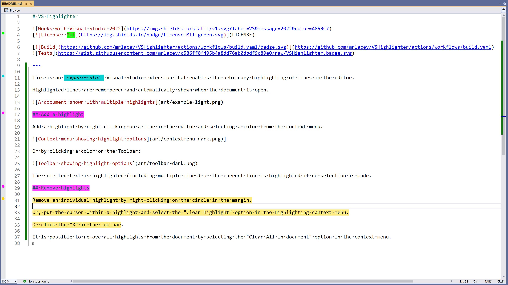
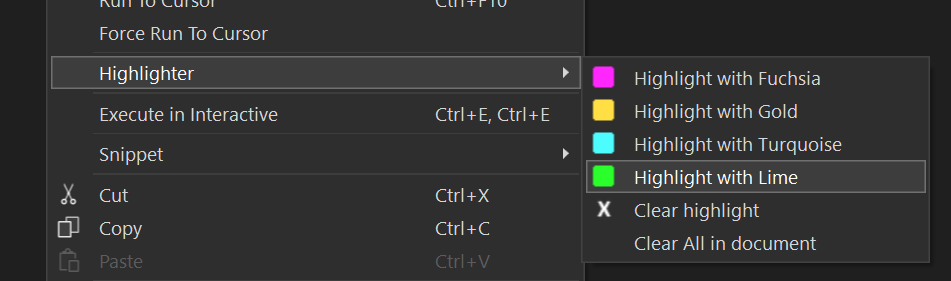

# VS Highlighter

---

This is an _experimental_ Visual Studio extension that enables the arbitrary highlighting of lines in the editor.

Highlighted lines are remembered and automatically shown when the document is open.

## Add a highlight

Add a highlight by right-clicking on a line in the editor and selecting a color from the context menu.

]

Or by clicking a color on the Toolbar:

The selected text is highlighted (including multiple lines) or the current line is highlighted if no selection is made.

## Remove highlights

Remove an individual highlight by right-clicking on the circle in the margin.

Or, put the cursor within a highlight and select the "Clear highlight" option in the Highlighting context menu.

Or click the "X" in the toolbar.

It is possible to remove all highlights from the document by selecting the "Clear All in document" option in the context menu.
